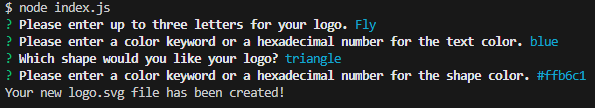
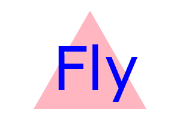

# SVG Logo Creator

## Description

In this project, I worked with javascript to create a SVG logo creator that uses terminal prompts to generate a quick user designed logo. I was motivated to create a simple logo creator that can be used to represent logos temporarily as the website is built and the graphic designer is finalizing the company design. In order to be assured that the code is working properly, I also created test files to test the functions of this SVG logo creator.

This code was created for the purpose of giving the user a simplified way to create a simple SVG logo file for their projects. It provides the opportunity to design a simple logo with a few prompts in the terminal for a more simplified option versus using other more complicated and sometimes pricy programs to generate a simple SVG logo.

Through the process of coding the SVG logo creator javascript files, I was able to learn more about connecting multiple javascript files to communicate with each other locally avoiding a single long and complicated javascript file. I also learned a lot about testing code with jest and testing javascript files.

[Here is a link to the video showing how it is used](https://youtu.be/6JgorICO2Mo).

---
---

## Table of Contents

- [Installation](#installation)
- [Usage](#usage)
- [Credits](#credits)
- [License](#license)

---
---

## Installation

In order to run this program, the user will have to have node.js installed on their device. Once that is complete, then using *node i* in the terminal will download the necessary inquirer and jest for the program to run as intended.

---

## Usage

To use the SVG logo creator, start with node index.js. From here the user will be prompted to answer a few simple questions that will make up what the logo will look like.

### Answering Questions

Once all the questions are answered, a logo.svg file will be created using the answers provided.

### New SVG logo example

Answering the prompts, I was able to create this logo.svg example.

---

## Credits
The Coding Bootcamp repositories for Boot Camp Curriculum Lesson Plans: https://github.com/coding-boot-camp

Visual Studio Marketplace: https://marketplace.visualstudio.com/items?itemName=jock.svg

Motion Tricks article about SVG files and javascript: https://www.motiontricks.com/creating-dynamic-svg-elements-with-javascript/

MDN SVG article: https://developer.mozilla.org/en-US/docs/Web/SVG/Tutorial/Basic_Shapes

Andrew Stehno (my TA) and Karina Guerrero Fernandez (my instructor)

Helpful Resources:
W3 School’s information about JavaScript: https://www.w3schools.com/js/default.asp
Stack Overflow’s answered questions about JavaScript: https://stackoverflow.com/
MDN’s information on JavaScript: https://developer.mozilla.org/en-US/
Google.com helping me find the above resources

The README template I used was provided by The Full-Stack Blog: https://coding-boot-camp.github.io/full-stack/github/professional-readme-guide

---

## License
MIT Licence
